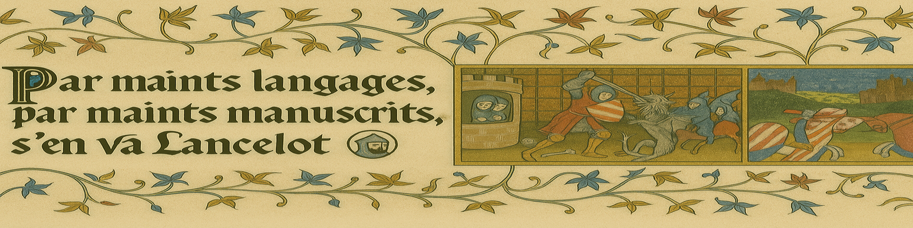
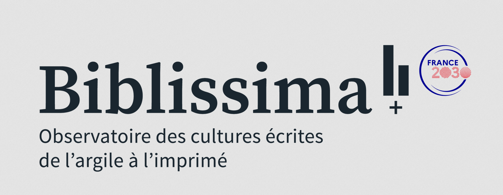

[](https://creativecommons.org/licenses/by-nc-sa/4.0/)
[](https://github.com/carolisteia/lancelot-par-maints-langages/commits/main)
[](https://github.com/carolisteia/lancelot-par-maints-langages)
[](https://github.com/carolisteia/lancelot-par-maints-langages/issues)

# 📜 Across Languages, Lancelot Rides  
*Tracing Lancelot’s journey not only through lands and courts, but through languages, manuscripts, and time.*

> An aligned multilingual corpus of the *Lancelot en prose*, processed with [Aquilign](https://github.com/ProMeText/Aquilign).


## 📚 Description

This repository contains training and evaluation data for the study of the multilingual medieval textual tradition of the *Lancelot en prose*, including manually corrected alignments and automatically generated outputs.

It features a curated selection of witnesses from the *Lancelot en prose*, one of the core cycles of the Arthurian literary corpus. The texts are presented in multiple medieval languages—Old French, Old Spanish (Castilian), and Old Italian—and have been automatically segmented and aligned using the [Aquilign](https://github.com/ProMeText/Aquilign) pipeline, a BERT-based tool for multilingual clause-level alignment of medieval texts.

In addition to alignment outputs, the repository includes manual corrections and evaluation files to support philological analysis and computational validation.

---

## 🧾 Context and Corpus Description

This project is part of a broader study on **computational multilingual alignment and stemmatological analysis** of medieval texts. The case study focuses on the *Lancelot en prose*, a major prose romance composed anonymously in the early 13th century. With at least 126 surviving manuscript witnesses and numerous translations, the *Lancelot* represents one of the most widespread and complex textual traditions of medieval Europe.

This corpus includes aligned segments from the Romance tradition—specifically:
- **Old French (source)**,
- **Castilian (Old Spanish)**, and
- **Old Italian**.

Due to the unstable and fragmentary nature of transmission, only **comparable segments** from selected witnesses were retained. Alignment is performed at the **clause (“sentence”) level**, preceded by a segmentation step using a custom-trained model. The aligned outputs are then used for **variant classification** and **stemmatological exploration**.

### Source Witnesses

The aligned corpus includes:

- **Lancellotto** (Italian): Florence, Biblioteca della Fondazione Ezio Franceschini, 1 (late 14th c.)
- **Lanzarote** (Castilian): Madrid, BNE, MS 9611 (copied from a 1414 exemplar)
- **Five French witnesses**, including:
  - Paris, BnF, fr. 111 (15th c.)
  - Paris, BnF, fr. 751 (13th c.)
  - Editions based on:
    - London, BL, Add. 10293
    - Cambridge, CCCC 45
    - Oxford, Bodleian Library, Rawlinson D. 899
  - The 1488 incunabula edition (Paris, BnF, RES-Y2-46 and RES-Y2-47)

Only three comparable segments were retained and aligned:
- `ii-48`, `ii-61`, and `iv-75`, based on the structure of the Micha edition.

---

## 🧰 Alignment Tool
The corpus was processed using **Aquilign**, a multilingual alignment tool developed by the [ProMeText](https://github.com/ProMeText) team.

- **Segmentation**: Performed at the clause level using custom token classification models.
- **Alignment**: Based on contextual embeddings using [LaBSE](https://github.com/google-research/bert/blob/master/multilingual.md).
- **Languages**: Old French, Old Spanish (Castilian), Old Italian

> Aquilign repository: [https://github.com/ProMeText/Aquilign](https://github.com/ProMeText/Aquilign)

---

## 🔍 Visualization

Example of multilingual alignment table:
👉 [View aligned chapter](https://prometext.github.io/Multilingual_Aegidius/data/aegidius/results/multilingual_tables_ft/livre_1/partie_2/chapitre_1/final_result.html)

## 🗂️ Structure


## 🔖 Citation
If you use the corpus or refer to the alignment methodology, please cite:

> Gille Levenson, M., Ing, L., & Camps, J.-B. (2024).  
> *Textual Transmission without Borders: Multiple Multilingual Alignment and Stemmatology of the "Lancelot en prose" (Medieval French, Castilian, Italian).*  
> In W. Haverals, M. Koolen, & L. Thompson (Eds.), *Proceedings of the Computational Humanities Research Conference 2024* (Vol. 3834, pp. 65–92). CEUR.  
> [https://ceur-ws.org/Vol-3834/#paper104](https://ceur-ws.org/Vol-3834/#paper104)

```bibtex
@inproceedings{gillelevenson_TextualTransmissionBorders_2024a,
  title = {Textual {{Transmission}} without {{Borders}}: {{Multiple Multilingual Alignment}} and {{Stemmatology}} of the ``{{Lancelot}} En Prose'' ({{Medieval French}}, {{Castilian}}, {{Italian}})},
  shorttitle = {Textual {{Transmission}} without {{Borders}}},
  booktitle = {Proceedings of the {{Computational Humanities}}   {{Research Conference}} 2024},
  author = {Gille Levenson, Matthias and Ing, Lucence and Camps, Jean-Baptiste},
  editor = {Haverals, Wouter and Koolen, Marijn and Thompson, Laure},
  date = {2024},
  series = {{{CEUR Workshop Proceedings}}},
  volume = {3834},
  pages = {65--92},
  publisher = {CEUR},
  location = {Aarhus, Denmark},
  issn = {1613-0073},
  url = {https://ceur-ws.org/Vol-3834/#paper104},
  urldate = {2024-12-09},
  eventtitle = {Computational {{Humanities Research}} 2024},
  langid = {english},
  file = {/home/mgl/Bureau/Travail/Bibliotheque_zoteros/storage/CIH7IAHV/Levenson et al. - 2024 - Textual Transmission without Borders Multiple Multilingual Alignment and Stemmatology of the ``Lanc.pdf}
}
```

## 🤝 Contributing to the Project

Contributions to the project are highly encouraged, whether they be additional data, bug fixes, or enhancements to the analysis scripts. To contribute:

1. **Fork the Repository** – Start by forking the repository and cloning it locally.  
2. **Create a Branch** – Make your changes in a new branch named after the feature or fix.  
3. **Submit a Pull Request** – After pushing your changes to your fork, open a pull request for discussion and review.

---

---

## 🔗 Related Projects

This repository is part of a broader ecosystem of tools and corpora developed for the study of medieval multilingual textual traditions:

- [Aquilign](https://github.com/ProMeText/Aquilign)  
  A clause-level multilingual alignment engine based on contextual embeddings (LaBSE), developed for medieval texts.

- [Multilingual Segmentation Data](https://github.com/ProMeText/multilingual-segmentation-data)  
Source texts and their segmented versions in multiple medieval Romance languages, as well as in Latin and English, used for training and evaluating clause segmentation models.

- [Multilingual Biblical Alignment Corpus](#) *(name and link TBD)*  
Training corpus for multilingual alignment, based on medieval and modern Bible translations in Romance languages, Latin, Greek, and English, designed to support supervised alignment approaches.

- [Multilingual Aegidius](https://github.com/ProMeText/Multilingual_Aegidius)  
A parallel corpus of translations of Aegidius Romanus’ De regimine principum in Latin, Medieval Romance languages, and English, segmented and aligned using the same pipeline.

## 💰 Funding

This work benefited from national funding managed by the **Agence Nationale de la Recherche** under the *Investissements d'avenir* programme with the reference **ANR-21-ESRE-0005 (Biblissima+)**.

> Ce travail a bénéficié d'une aide de l’État gérée par l’**Agence Nationale de la Recherche** au titre du programme d’**Investissements d’avenir** portant la référence **ANR-21-ESRE-0005 (Biblissima+)**.




## ⚖️ Licensing

This project is licensed under the [CC BY-NC-SA 4.0](https://creativecommons.org/licenses/by-nc-sa/4.0/) license.  
This license allows users to adapt, remix, and build upon the work non-commercially, as long as they credit the authors and license their new creations under the same terms.


